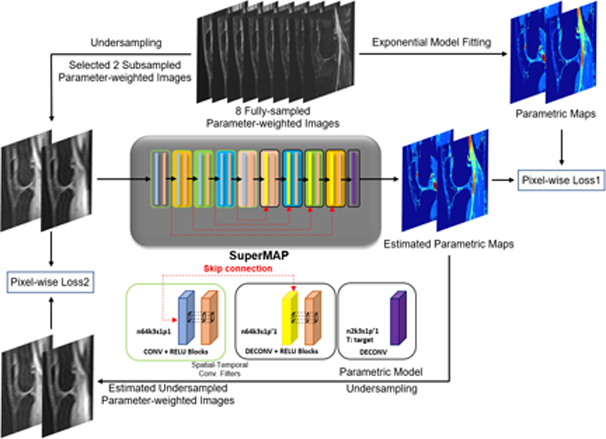

# SuperMAP: Deep ultrafast MR relaxometry with joint spatiotemporal undersampling

This repository supports the research paper:

**To develop an ultrafast and robust MR parameter mapping network using deep learning**  

📄 [Read the paper](https://pubmed.ncbi.nlm.nih.gov/36128884/)

## Citation

If you use this work, please cite:

> Li H, Yang M, Kim JH, Zhang C, Liu R, Huang P, Liang D, Zhang X, Li X, Ying L. SuperMAP: Deep ultrafast MR relaxometry with joint spatiotemporal undersampling. Magn Reson Med. 2023 Jan;89(1):64-76. doi: 10.1002/mrm.29411. Epub 2022 Sep 21. PMID: 36128884; PMCID: PMC9617769.

